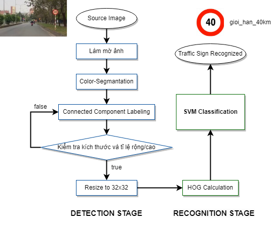
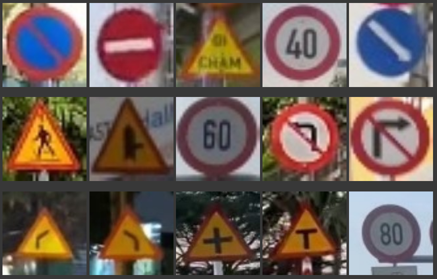
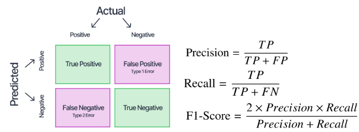

# Thiết kế mô hình nhận diện biển báo giao thông sử dụng Machine Learning

## Mô tả: 
Thiết kế mô hình TSR (Traffic Signs Recognition) sử dụng mô hình SVM và công đoạn tiền xử lý ảnh . Mô hình được ứng dụng trong các camera hành trình, kiểm tra các biển báo xuất hiện trên đường và báo về cho người lái để người lái xe có thể điều khiển phương tiện một cách tốt nhất.
## Các nguồn tham khảo:
[Tham khảo mô hình](https://www.scirp.org/journal/paperinformation?paperid=86077)

[Tham khảo metrics](https://www.v7labs.com/blog/confusion-matrix-guide#confusion-matrix-for-multiple-classes)
## Workflow:

## Dataset:

Bộ dữ liệu được chuẩn bị sẽ giới hạn việc nhận diện các biển báo sau: 

## Đánh giá mô hình:

Sử dụng phương pháp confusion matrix,  tính Precision, Recall, F1_Score để đánh giá mô hình:

Vì sự thiếu hụt của bộ dữ liệu nên các chỉ số precision và recall của các thành phần có chỉ số thấp đa phần là các thành phần mà dataset thuộc class đó ít ( giao động từ 40 đến 200 )
Mô hình của nhóm đã được xây dựng với khả năng học tập tốt, tuy nhiên vì sự thiếu hụt của bộ dữ liệu nên các chỉ số precision và recall của một số lớp khá thấp , ảnh hưởng đến đánh giá hiệu năng của toàn bộ mô hình 

## Chi tiết hệ thống: 

Chi tiết về hoạt động hệ thống trong từng giai đoạn, đánh giá hiệu năng mô hình được thể hiện trong file notebook.   
 
